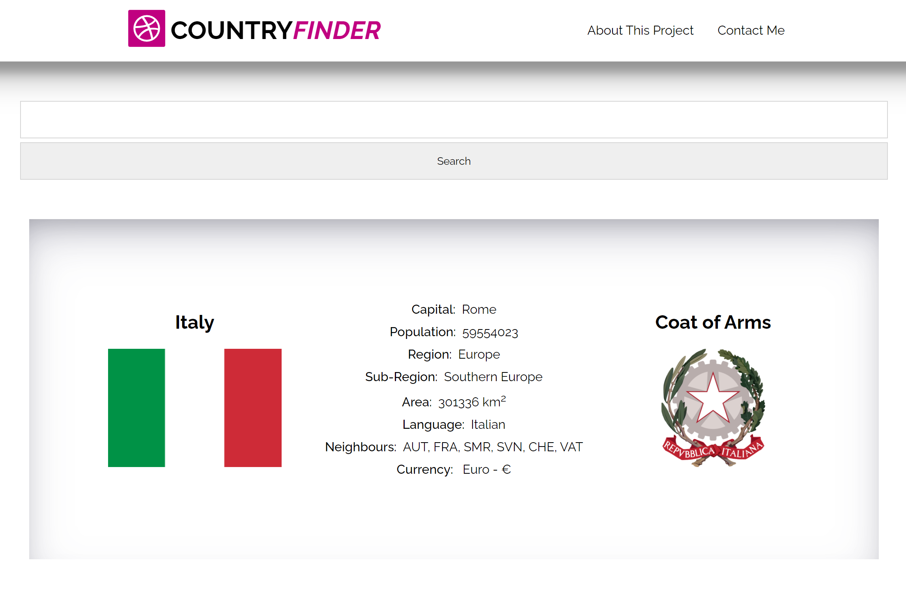

# Intro to my first project

The Country Finder project was developed as part of a DCI API module taught by Syed Naqvi. [[This is a link to Syed Naqvi's github.com/nrcool](https://github.com/nrcool)] 

## Library Platform
This project was developed using React. [[This is a link to React](https://reactjs.org/)]

## Rest Countries API
The Country Finder project fetches data dynamically from the Rest Countries API and draws upon API Endpoints V3.  [This is a link to the Rest Countries API](https://restcountries.com/)]

## Data

The data provided upon country search is the following:
- flag image
- capital
- population
- region
- sub-region
- area
- language/s
- border neighbour/s
- currency
- image of coat of arms

## Contact Form

The contact me form is grid-based and data is captured via EmaoilJS directly from Javascript.  [This is a link to EmailJS documentation](https://www.emailjs.com/docs/)]

## Snippets

The following are some image snippets. The project is responsive.

